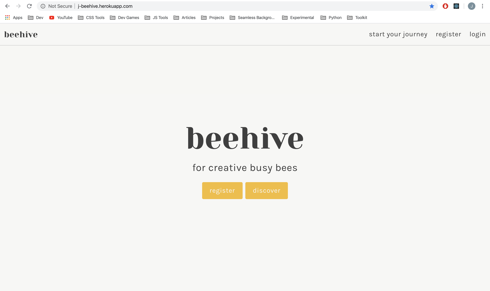
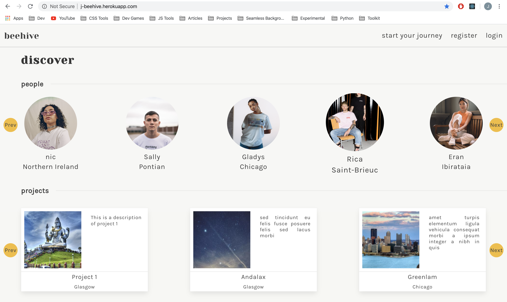
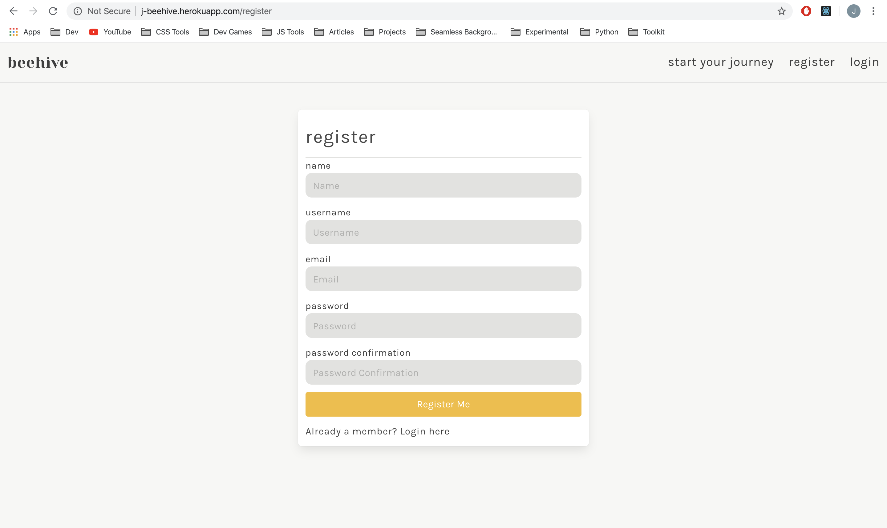
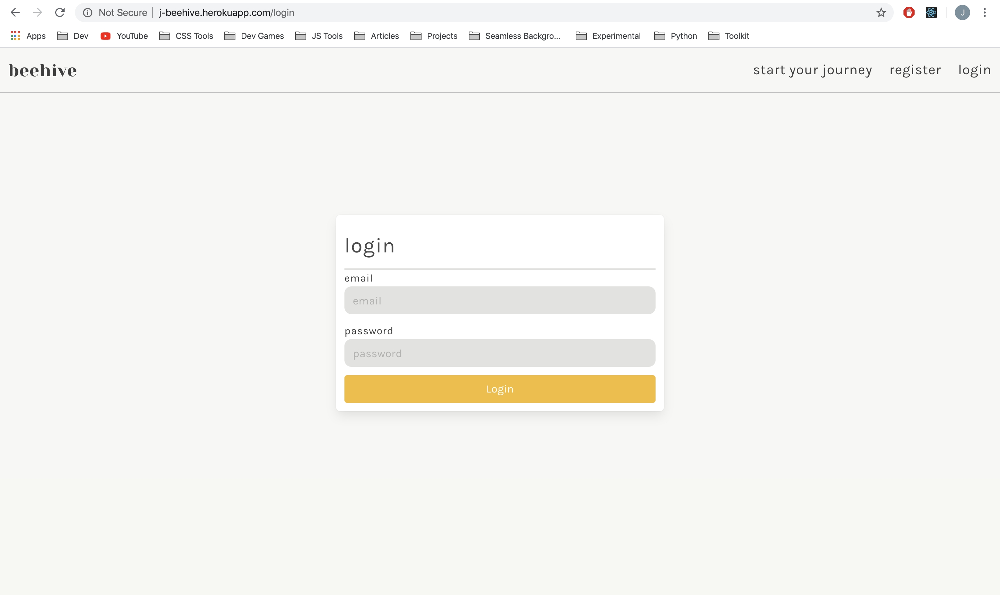
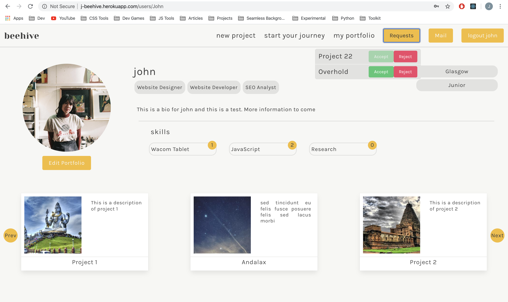
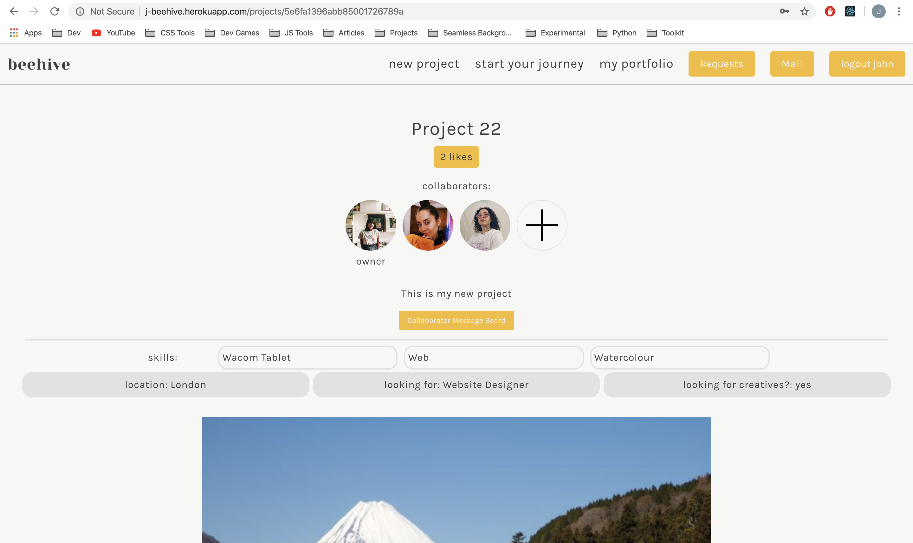
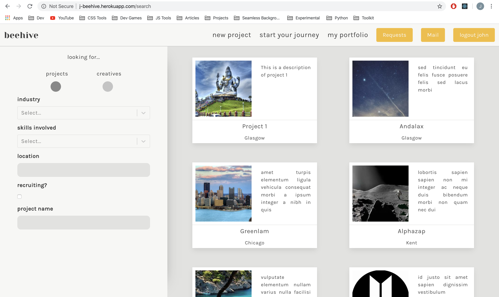
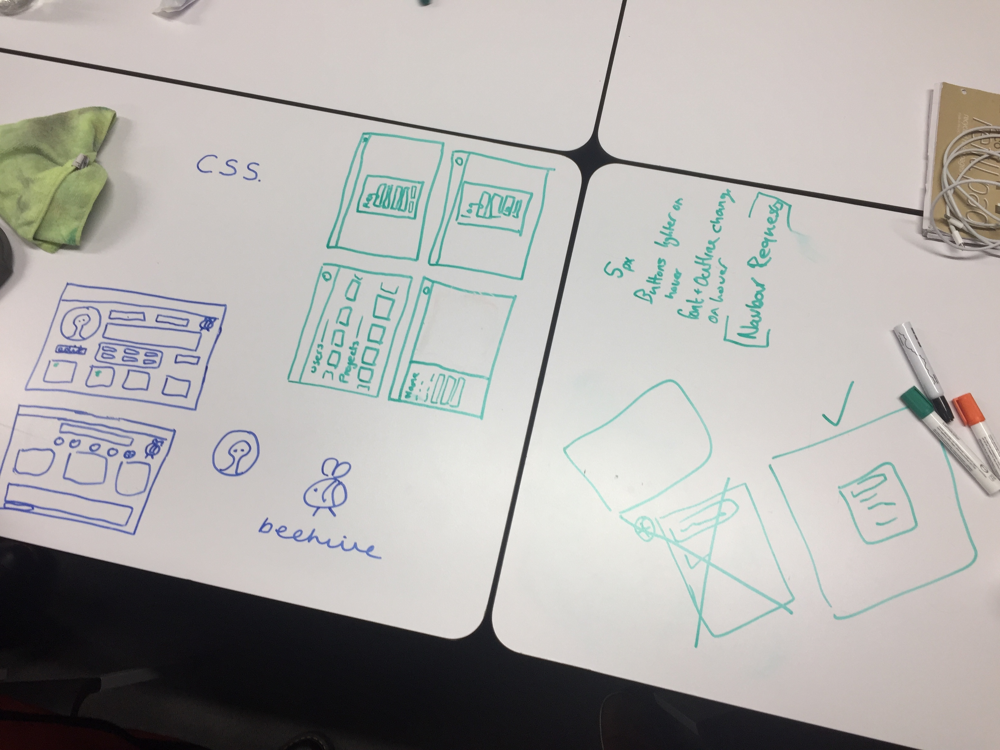
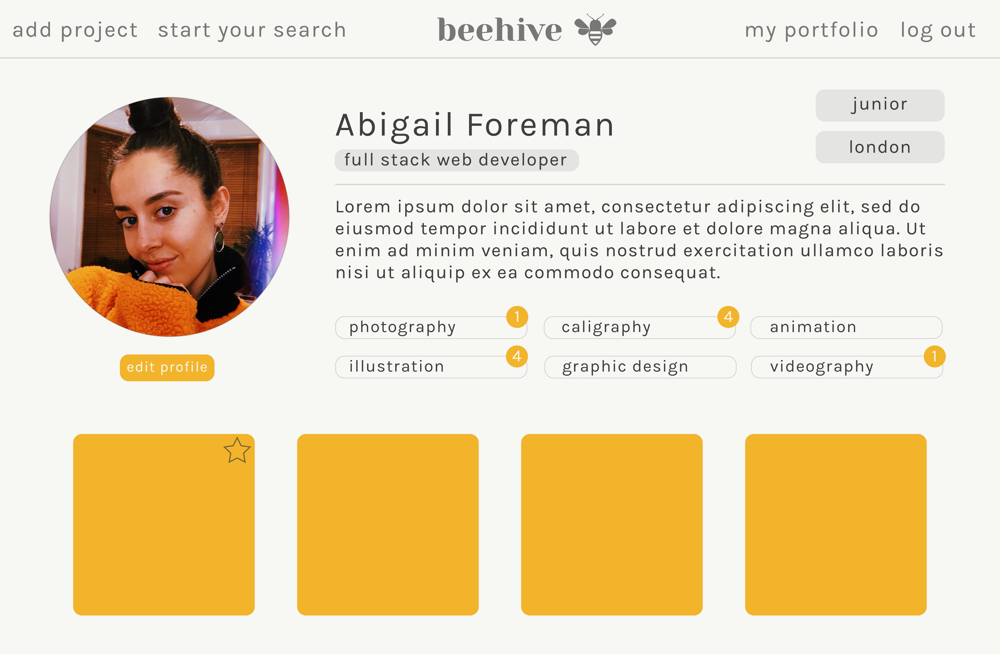
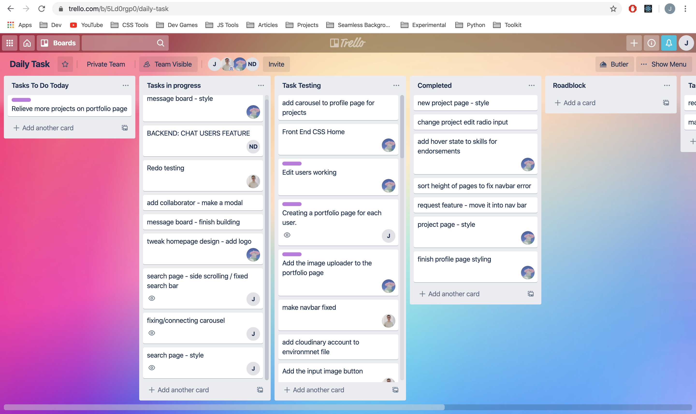

# General Assembly Project 3 - Beehive

[Deployed Project Link](https://j-beehive.herokuapp.com/)

Beehive was my third project at General Assembly. This project was done in a team of four and was our first attempt at building a full stack web application. This Project was done over seven-eight days.

## My Teammates were:
- [Abigail Foreman](https://github.com/abigailforeman1)
- [John Magnus Robertson](https://github.com/jaymagrob)
- [Nicolas Dolan](https://github.com/Nicolas-Dolan)

## Task Brief

* **Build a full-stack application**
* **Use an Express API**
* **Implement thoughtful user stories**
* **Be deployed online**
* **Have automated testing**

## Technologies Used

* JavaScript (ES6)
* HTML5
* CSS3
* Bulma
* React.js
* Express
* Mongoose
* MongoDB
* Mocha
* Chai
* Axios
* Git
* GitHub
* Insomnia
* Cloudinary

## Installation

* Clone or download the repo
* In the project root install all of project the dependencies with `yarn` 
* In the project room run the command `yarn start`
* Ensure the terminal responds with 'app is listening on port 4000'
* Open your chosen browser and navigate to `http://localhost:4000/`

## Overview

At the beginning of this project we spent half a day brainstorming ideas and potential concepts for the web application. In the end we unanimously ended up settling on a platform for creatives who are looking for work or to show off their own work. We had a lot of influence from the website The Dots as a reference point along the way as in terms of functionality and design The Dots was a large source of inspiration. The core functionality of the application is based around Users, Projects and how the two interact with each other and themselves.

# Walkthrough

## Landing Page
The Landing page is the first page users see. We have a navbar at the top which allows users to login, register and search (start your journey). Clicking the discover button will scroll the user down to the featured users and projects. 



## Discover
The discover page displays a handful of users and projets on a carousel.



## Register Page
The Register page, when invalid information is sent to the back end small red subtext will appear beneath the corresponding field.



## Login Page
Similar with the register page, when invalid information is sent to the back end subtext informing the user.



## Profile Page
The Profile page is where all of the information about a user is stored, housing their projects, skills and bio and more. If a user goes onto their own profile whilst logged in they have the option to edit their profile in a form much like the register which includes options such as adding skills and uploading the users own photos to cloudinary. Once logged in the navbar at the top changes to include various user accessible things such as a logout button, my portfolio link that takes the user to their own profile page and a requests tab that opens up requests made by others and from the user to join various projects. The profile page also buttons for each skill that other users can click to endorse.



## Project Page
The Project page is the display page for an individual project, showing core information such as users, likes, skills, images etc. This page also gives users functionality to like, comment, request to be added to the project if not already a collaborator or add another user if already part of the project. A message board unique to each project and only accessible by the collaborators also lives here.



## Project Comments
Further down on the project page are the project comments, with the functionality to edit or delete one's own comments.


## Search Page
Beehive's search functionality allows users to easily look up either users or projects depending on any of their details, from location to skills or name.



## Extra Functionality
We packed the Beehive full of functionality in the time we had, aspects such as the carousel makes for a nice interactive user experience whilst the extra step of requests to join a project and having the ability to accept or decline them gives an extra level of depth to the application. Our search functionality is very robust and allows any combination or search criteria. We also have a couple of different methods of communication, with direct chat between users, comments for logged in users on any project and a project message board exclusively for collaborators. Even small tweaks to the user story make big difference, such as boolean that detects if it is a user's first time logging in and redirects them to a unique page that welcomes the new user to the website.

## Process
We took the approach of trying to get as much work done off the computer as we possibly could.

1. We spent the first half a day brainstorming and coming up with project ideas.
2. After settling on our idea we began to build up our back end models on a whiteboard.
3. We wireframed the user journey and each of the pages that we wanted to include.
4. One of our group (Abigail Foreman) then mocked up some prototype designs in Indesign/Illustrator.
5. We next started on the back end. With our focus on building out the models, views, controllers and testing.
6. After the first four days our back end was built out to the extent that we felt comfortable starting on the front end.
7. At first we simply got the functionality to work on the front end and then once the correct data was being pulled through and most of the functionality was present we moved onto styling and design, attempting to replicate the prototype designs using a combination of Bulma and custom styling.




We used Trello throughout the process as our project management tool. Each morning we would group up and talk one by one about what we'd achieved the day before, what we thought still needed to be done and then we'd add any extra cards to the trello board based on what we thought we needed to do. We would then each claim a couple for the day and try to make sure that we weren't encroaching on any files that eachother were working on to avoid merge conflicts.



## Division of work

In the back end the main parts that I worked on were:
* Project controllers
* User controllers
* Collaboration request feature
* User model

Whilst on the front end I worked on:
* Search layout
* Collab request functionality and layout
* Navbar
* Welcome page
* User/Project carousel
* Project card layout

# Reflections

## Featured Code

This piece of code is part of the user controller that I wrote and is what controls the skill endorsement. Though not the most complex piece of code I'm happy with how cleanly it came out as it allows dual functionality for one endpoint. This is a secure route through the back end and so is only accessible if the user is logged in, hence the username that is attached to the `req.currentUser`. The like/endorse controller below is a toggle to with the exact same endpoint/request it checks if the user has already liked a skill and then either adds or removes the like depending whether the user has already liked it.

```javascript
function like(req, res) {
  User
    .findOne({ username: req.params.username })
    .populate('createdProjects')
    .populate('collaboratedProjects')
    .then(user => {
      if (!user) return res.status(404).json({ message: 'Not Found ' })
      if (req.currentUser._id.toString() === user._id.toString()) return res.status(401).json({ message: 'Unauthorized' })
      const skill = user.skills.id(req.params.skill)
      const users = skill.likes.map(like => like.user)
      if (!users.includes(req.currentUser._id)) {
        skill.likes.push({ user: req.currentUser._id })
      } else {
        const newLikes = skill.likes.filter(like => like.user._id.toString() !== req.currentUser._id.toString())
        skill.likes = newLikes
      }
      return user.save()
    })
    .then(user => res.status(202).json(user))
    .catch(err => res.status(400).json(err))
}
```
This is a piece of code that I wrote from the front end of the application. It is part of the navbar component and is part of what allows the navbar to update. This function runs on every time the navbar is re-rendered, with a check to make sure that it is only running when the path has been changed so as not to create a render loop. It then uses the functions passed down as props to update state or make the necessary requests to the back end. For example, when the page is changed, the navbar updates, checks if the pathname has changed and then closes the pending requests tab if it has.

```javascript
  async componentDidUpdate(prevProps) {
    if (this.props.location.pathname !== prevProps.location.pathname) {
      this.props.getUser()
      if (this.props.open) {
        this.props.handleOpen()
      }
      this.setState({ navbarOpen: false })
      if (Auth.isAuthenticated()) {
        try {
          const res = await axios.get('/api/myportfolio', {
            headers: { Authorization: `Bearer ${Auth.getToken()}` }
          })
          this.setState({ name: res.data.name, username: res.data.username })
        } catch (err) {
          console.log(err)
        }
      }
    }
  }
```

## Wins
One issue that we were having trouble with that I managed to find a solution to was on the front end navbar functionality. Due to the REST nature of our back end, when something is updated in the back end the front end is not automatically updated. The front end is only updated by initiative of the front end. As we used React.js on the front end, our application is routed in such a way that the navbar and other components are separated from each other, with the navbar and its subcomponents being outside of the main router switch. This meant that when a change is made in the main area of the application, the navbar is not updated as the components have no way of interacting with one another. For example, when a collaboration request is sent, whilst the back end would be updated, the pending requests in the navbar would not be updated until the page was refreshed. To work around this, I managed to pull the functionality and state that would cause such a change to higher level components and then pass down those functions and state to the necessary components as props. This would allow functions to enact those changes that would affect another separate component and trigger it to update.


## Challenges
One of the trickiest parts of the project for me was the pending project requests. Although there are many different ways of approaching the task, due to time constraints I didn't have much time to evaluate the options fully and so I went with the method that made the most immediate sense. This method was adding a pending requests field to each user model which was an array of projects. When coding the front end functionality I ran into a couple of issues with this methodology as I endeavored to allow the requester and recipient to both accept and decline the request. Whilst the current functionality does work well, in hindsight I would probably look to create another independant request model to specifically handle this functionality.

## What Next
Whilst there are many ways that I think our application could be improved, some of the main things that I would address first of all would be:

* Front end direct message slight redesign
* We approached the project with desktop first in mind so I would try to add more responsivity.
* Change the messaging and potentially collaboration requests to rely on WebSockets rather than our REST API.
* Look at different collaboration request methodological options.
* Allow for a project to have multiple owners.

## Key Learnings
Similarly to my second project, many of my takeaways from this project were about coding as a team. This was my first time using Github with multiple people editing one repository. Learning to avoid merge conflicts, trying to make sure that we were aware of what each other were working on and who was using which files. This project was also an exercise in project planning and expectation management. We planned very well but even then only just managed to pull off the scope that we wanted as we were very ambitious with the project. We went in with lots of great ideas but ended up having to shelf many of them due to time and resource constraints.